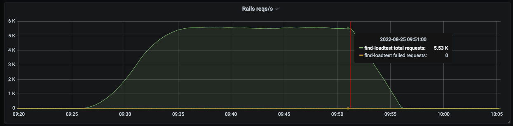
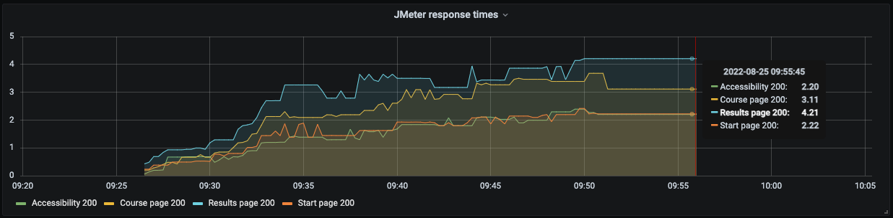
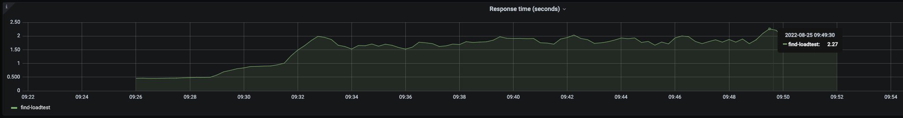
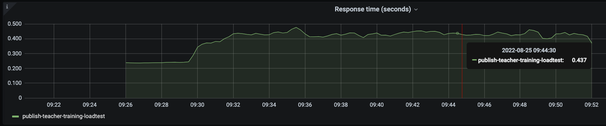

## Intro
This is the writeup for the August 2022 Find load testing. There were a couple of tests, but the results for the most rigorous tests indicated that there weren't any areas of the app that need critical attention. 

## The test plan
The test plan, found at `plans/find.rb` gets each thread to visit four different routes
* The start page
* The results page for a widely scoped search
* The course page for a single course
* The accessibility page from the footer

The intention was to see what sort of effects putting load on different types of page would have. 

The test was ultimately run for around half an hour with the following config
```
app_env_variables = {
  JMETER_TARGET_PLAN      = "find"
  JMETER_THREAD_COUNT     = 150 
  JMETER_RAMPUP           = 360
  JMETER_WAIT_FACTOR      = 0.5
  JMETER_TARGET_BASEURL   = "https://find-loadtest.london.cloudapps.digital"
  JMETER_TARGET_APP       = "find-loadtest"
  JMETER_TARGET_APP_SPACE = "bat-prod"
}
```

## Test results
The jmeter tests ramped up to sending ~5k requests a second. This is likely well over our peak expected load.


The response times for the static pages were both around 2.2 seconds, while the pages that requried a Publish API call were a bit longer. The large search results page took the longest, which is expected. 


The Find response times climbed up as the test intensity crept up, and levelled out accordingly. 



The Publish requests sent from Find were not very taxing, and were responded to without much effort.


Overall, it wasn't possible to identify any particular bottlenecks or slow queries. In the future, it may be beneficial to include other URLs that are suspected of being slow, to see if they are resulting in disproportionately slow responses. 

A test was run with a `JMETER_THREAD_COUNT` of `300`. This resulted in much more significant slowdown, with responses reaching 20 seconds. However, the application still managed to send responses, and it is expected that extremely heavy load would result in slower and slower responses.


